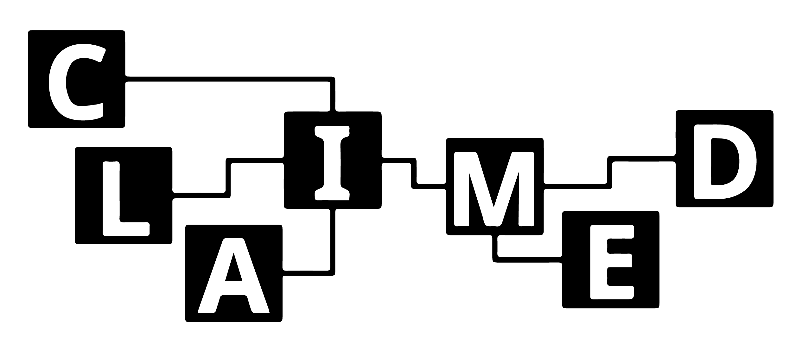

# CLAIMED Related Logos and Artwork 
In this folder, we provide CLAIMED artwork in 2 standard formats (SVG and PNG), and in 3 versions (color/black/white). 

<table class="logos-table">
	<thead>
		<tr>
			<th></th>
			<th colspan="1">PNG</th>
			<th colspan="1">SVG</th>
		</tr>
		<tr>
			<th></th>
			<th>Icon</th>
			<th>Icon</th>
		</tr>
	</thead>	
    <tbody>
		  <tr>
			  <th>Color</th>
			  <td></td>
			  <td></td>
		  </tr>
    <tr>
     <th>Black</th>
			<td></td>
			<td></td>
		</tr>
      <tr>
			<th>White</th>
			<td></td>
			<td></td>
		</tr>
	</tbody>	
</table>

# Use of trademark or logo 
Please refer to Linux Foundation Trademark Usage page to learn about the usage policy and guidelines: https://www.linuxfoundation.org/trademark-usage. 

# Questions? 
Please email info@lfaidata.foundation.
